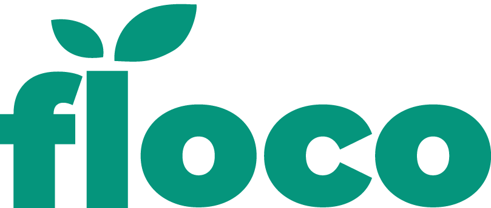

# Welcome in an awesome App documentation !



## `Presentation`

Floco is a client project created by 4 [Wild Code School](https://www.wildcodeschool.com/) students in one month and a half.

The application [(PWA)](https://fr.wikipedia.org/wiki/Progressive_web_app) is made to encourage users to participate in the reimplantation of certain plants, in danger of extinction in Strasbourg region.

## `File directory`

```
public/
├─── src/
|   ├── assets/  # Images
|   |
|   ├──components/ # Folder which contains all components'folder, every component folder contains a css file
|   |   |
|   │   ├── Account/
|   │   │   ... # tresaury -> contains the user level badge and the points he won
|   |   |
|   │   ├── Agenda (Diary)/
|   │   │   ... # Empty folder -> season schedule for planting and blossom
|   │   │
|   │   ├── Bibliothèque (Library)/
|   |   |  ... # File search -> allows searching for plants selected by users
|   |   |  |
|   |   |  └── Plants/
|   |   |   ... # Folder which contains specification plants sheets
|   │   |
|   │   ├── Connexion/
|   |   |  └─── Home/
|   |   |   ... # Part which allows login or register
|   |   |  └─── Login/
|   |   |   ... # Part which allows login, also by Google and Facebook
|   |   |  └─── Register/
|   |   |   ... # Part which allows account creation
|   │   |
|   |   ├── Layouts/
|   |   |   ... # Contains burger menu, footer, layouts
|   |   |
|   |   ├── Main/
|   |   |  └─── Map/
|   |   |       ... # Homepage which contains a Map with modal and user's plant localisation points
|   |   |  └─── Stats/
|   |   |       ... # Oxygen level graphics
|   |   |
|   |   ├── MiniFlora/
|   |   |  └─── Access/
|   |   |       ... # Users inscription part
|   |   |  └─── Compass/
|   |   |       ... #
|   |   |  └─── Partner/
|   |   |       ... # Partner listing
|   |   |  └─── Pot/
|   |   |       ... # Flower pots listing
|   |   |  └─── Progress/
|   |   |       ... # This part represent the user plant evolution from acquisition through the partner to plant development
|   |   |
|   |   ├── Reducers
|   |   |   ... # Contains all files required by Reducer
|   |   |
|   |   |
|   |   └── components/
|   └── src/
|
├── .env/
|   ... # Contains heroku.app deployment link
|
└── public/

```

## `Connect back and front`

### Open front side application:

Create a programming environment, changing the URL in file : _.env_

```
REACT_APP_API_URL="https://floco-app.herokuapp.com/"
```

### Open back side application:

Doing like in example.env

#### `Technic Stack`

- Semantic ui React
- Axios
- Chart.js
- Leaflet
- Node-sass
- React
- React-leaflet
- React-router-dom
- Redux

## `The Team`


Wild Code School cool students

- [Dominic Brice](https://github.com/dominicBrice)
- [Lucas Leproux](https://github.com/lucas240)
- [Jules Bonard](https://github.com/julesbonard)
- [Frédérique Mendy](https://github.com/Superdref)

## Project leader: "Ying Wang"
